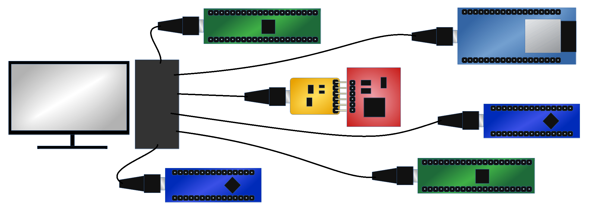
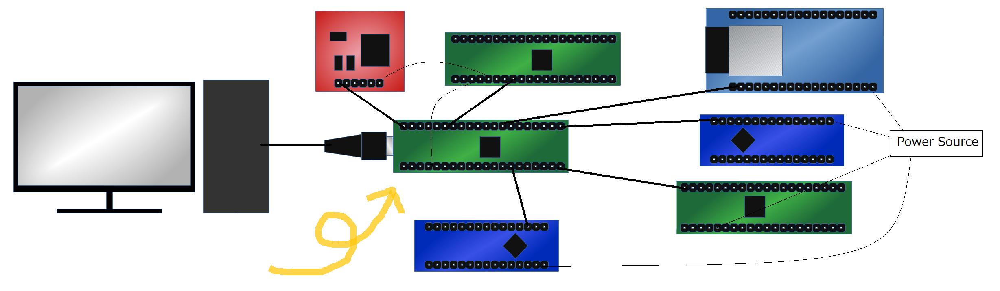
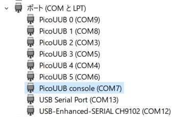
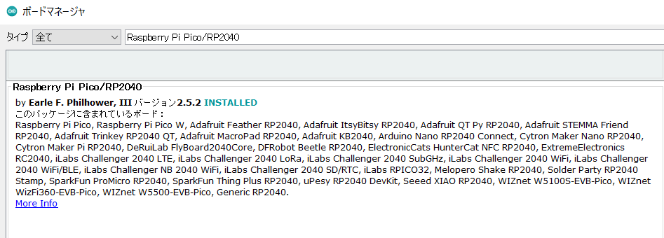

# 1.Multiple USB UART Bridge
This is multiple USB UART Bridge with Raspberry Pi Pico.
I know there are some similar implementations, but this has useful additional functions for dev environment.

* 6 USB-UART Bridges
    * 2 Pico Hardware UARTs
    * 4 PIO Based UARTs provided by [Arduino Pico/RP2040 board package](https://github.com/earlephilhower/arduino-pico)
* Pico USB Console other than the Bridges is also available for some functions
    * Capturing USB-UART Bridged data
    * counts Tx/Rx Bytes of each USB-UART Bridge

**Before**  


**After**  



# 2.How To Use
## 2.1.Write UF2 to Pico and connect to your PC
You can use [complied UF2 file](./UsbUartBridgePico.ino.uf2) in convenient.  
If you will build UF2 yourself see [#4.Build Requirement](#4build-requirement)

## 2.2.Find COM port numbers if you use windows
This is troublesome work but needed. You can find 7 new USB COM ports on Device Manager.
* Find COM ports witch 'Device Instance Path' of property is  
    USB&yen;**VID_2E8A**&**PID_000A**&MI_00&yen;...

* Note the linked COM port numbers  
USB¥VID_2E8A&PID_000A&**MI_00**¥...  
MI_00 = Pico USB console  
MI_02 = USB-UART Bridge 0  
MI_04 = USB-UART Bridge 1  
MI_06 = USB-UART Bridge 2  
MI_08 = USB-UART Bridge 3  
MI_0a = USB-UART Bridge 4  
MI_0c = USB-UART Bridge 5

I changed COM port FriendlyName in the Registry at my own risk to escape from pain.  


## 2.3.Connect devices to Bridge UARTs 
|Bridge|GPIO Pin (Tx/Rx)|
|----|----|
|USB-UART Bridge 0|0/1|
|USB-UART Bridge 1|4/5|
|USB-UART Bridge 2|8/9|
|USB-UART Bridge 3|12/13|
|USB-UART Bridge 4|16/17|
|USB-UART Bridge 5|20/21|

# 3.Example
* PC(COM9) ---[Bridge0 USB]--- Pico ---[Bridge0 UART]--- DeviceA
                            |
* PC(COM7) ---[Pico cons]----
## 3.1.'help' at USB console
Type 'help' at COM7 terminal.
This is vscode SERIAL MONITOR example.
```
---- Sent message: "help\n" ----
Usage: 
  show              : show current parameters
  cap num           : enable capture for bridge<n>
  uncap num         : disable capture for bridge<num>
  capmode num mode  : set capture mode for bridge<num> to <mode>
                    : mode: 1=TXT, 2=BIN, 3=TXT&BIN
  clear {num | all} : clear bytes count
  help              : print this help
```
## 3.2.setup to capture data stream
Type 'cap 0', 'capmode 0 1' and 'show'
```
---- Sent message: "cap 0\n" ----
Capture:
  enable for B0 (GP0/1)
---- Sent message: "capmode 0 1\n" ----
Cpature mode:
  B0 (GP0/1) capture mode to 1
---- Sent message: "show\n" ----
Show:
  bridge        |  baudrt | capture | capmode |  usb->uart |  uart->usb
  B0 (GP0/1)    |  115200 | on      | TXT     |          0 |          0
  B1 (GP4/5)    |  115200 | off     |     BIN |          0 |          0
  B2 (GP8/9)    |  115200 | off     |     BIN |          0 |          0
  B3 (GP12/13)  |  115200 | off     |     BIN |          0 |          0
  B4 (GP16/17)  |  115200 | off     |     BIN |          0 |          0
  B5 (GP20/21)  |  115200 | off     |     BIN |          0 |          0
```
## 3.3.capture 'Hello World !'
Run sample MicroPython Program at the DeviceA
```
import time
from machine import UART,Pin

u = UART(0, 115200)
i = 0
while True:
    u.write(str(i))
    i += 1
    u.write(' hello World !\n')

    time.sleep(1)
```
Then the Bridge captures them at COM7
```
B0 (GP0/1) (uart->usb txt): 0
B0 (GP0/1) (uart->usb txt):  
B0 (GP0/1) (uart->usb txt): h
B0 (GP0/1) (uart->usb txt): e
B0 (GP0/1) (uart->usb txt): l
B0 (GP0/1) (uart->usb txt): l
B0 (GP0/1) (uart->usb txt): o
B0 (GP0/1) (uart->usb txt):  
B0 (GP0/1) (uart->usb txt): W
B0 (GP0/1) (uart->usb txt): o
B0 (GP0/1) (uart->usb txt): r
B0 (GP0/1) (uart->usb txt): l
B0 (GP0/1) (uart->usb txt): d
B0 (GP0/1) (uart->usb txt):  
B0 (GP0/1) (uart->usb txt): !
B0 (GP0/1) (uart->usb txt): 
...
```
COM9 terminal shows
```
0 hello World !
1 hello World !
2 hello World !
3 hello World !
...
```

# 4.Build Requirement
* Required software
    * Arduino IDE
    * [Arduino Pico/RP2040 board package](https://github.com/earlephilhower/arduino-pico)
    
* Board Configuration
    * Use Adafruit TinyUSB as USB stack in the board configuration menu
* You have to change some package source code
    * '#define CFG_TUD_CDC **1**' to '#define CFG_TUD_CDC **7**'  
in the tusb_config_rt2040.h
    * 'uint8_t _desc_cfg_buffer[**256**];' to 'uint8_t _desc_cfg_buffer[**1024**];'  
in the class Adafruit_USBD_Device in the Adafruit_USBD_Device.h

# 5.Important Notes
* UART Baudrate is fixed 115200 bps. if you change it you have to change source code.
* Use LF or CRLF to send commands to Pico USB console.
* Capture function is for light debugging purpose. Capturing multiple bridges at the same time can overflows the buffer.

# 6.ToDo
* buffered capturing.
* triggered capturing
* rewriting data stream
* and so on..
